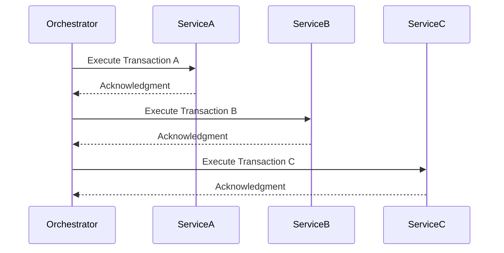
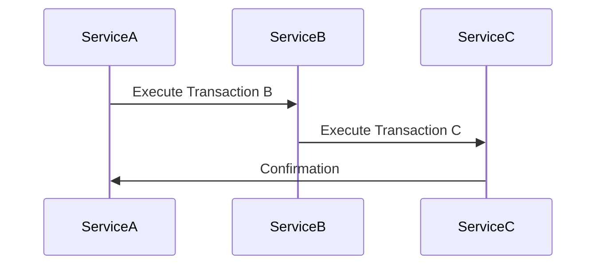
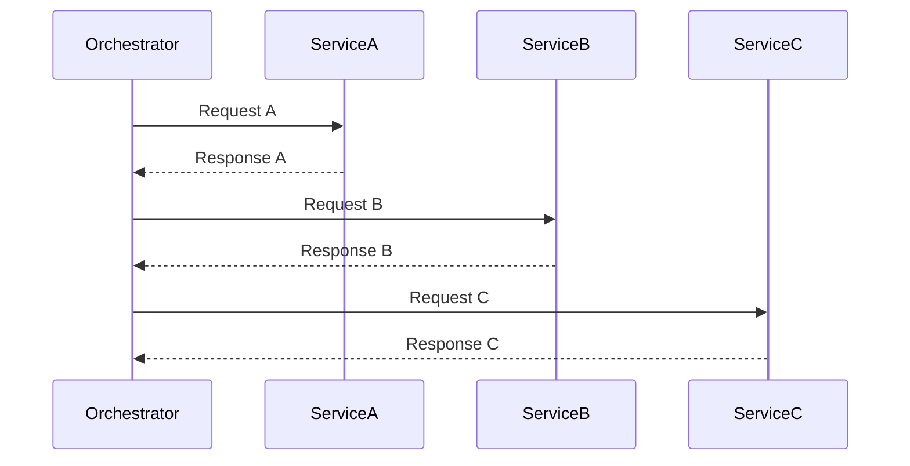
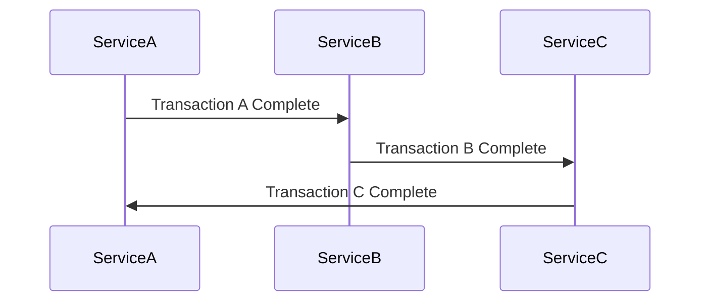
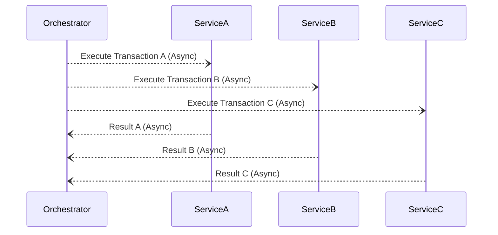
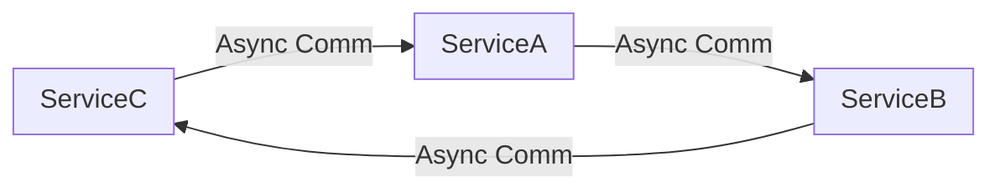
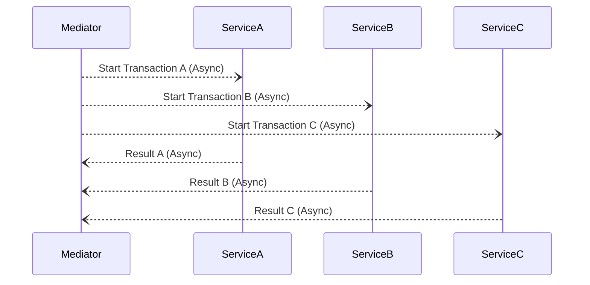
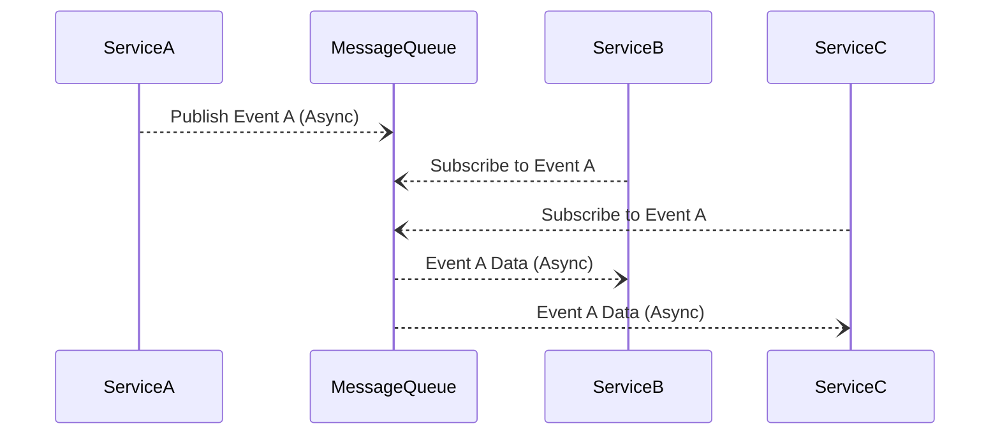

🚀 **Demystifying Transactional Sagas with Real-Life and Software Examples!**

Let's explore these saga patterns with relatable scenarios, software practices, and a sprinkle of fun! 🎉

---

1. **Epic Saga (Orchestrated Saga)** 🎻

   - **Explanation**: Imagine a symphony orchestra with a conductor directing every musician. A central coordinator manages each transaction step synchronously, similar to how a monolithic system operates.
   
   - **Real-Life Example**: A traditional assembly line where each worker waits for instructions from a supervisor before proceeding.
   
   - **Software Example**: An online retail platform where a central workflow engine sequentially coordinates inventory checks, payment processing, and shipment scheduling. Each step must complete before the next begins, ensuring strict control but potentially slowing down the process.

---

2. **Phone Tag Saga** 📞

   - **Explanation**: Like playing a game of telephone, each transaction independently triggers the next without a central coordinator.
   
   - **Real-Life Example**: Passing a message along a chain of people at a party, hoping it remains intact.
   
   - **Software Example**: In a microservices architecture, an order service processes an order and directly calls the inventory service. Upon updating the stock, the inventory service calls the shipping service, and so on. This chain continues without a central orchestrator, ideal for simple workflows with minimal error handling.

---

3. **Fairy Tale Saga** 🧚‍♀️

   - **Explanation**: An orchestrator coordinates requests and responses but doesn't micromanage the internal transactions of each service.
   
   - **Real-Life Example**: A project manager assigns tasks but allows team members to execute them autonomously, trusting their expertise.
   
   - **Software Example**: In ride-sharing apps, a central dispatch service matches riders with drivers. Once matched, drivers independently navigate to pick-up and drop-off locations without further instructions from the dispatcher, allowing for flexibility and efficiency.
  

---

4. **Time Travel Saga** ⏳

   - **Explanation**: Services communicate synchronously with eventual consistency but without a central mediator, relying on a choreographed workflow.
   
   - **Real-Life Example**: A relay race where each runner starts running when they see the previous runner approaching, without any official signaling.
   
   - **Software Example**: Event-driven systems where services react to events published by others. For instance, in a payment processing system, the payment service publishes an event upon transaction completion, and the notification service listens for this event to send a receipt, all happening without direct coordination.

---

5. **Fantasy Fiction Saga** 🧙‍♂️

   - **Explanation**: Attempts to improve performance by adding asynchronous communication to the Epic Saga but often adds complexity due to coordination challenges.
   
   - **Real-Life Example**: Trying to organize a surprise party via emails sent at different times—details get lost, and surprises get spoiled.
   
   - **Software Example**: A hotel booking system that sends asynchronous requests to check room availability, process payments, and confirm bookings simultaneously. Without proper coordination, this can lead to double bookings or payment issues due to the asynchronous nature and lack of strict control.

---

6. **Horror Story Saga** 👻

   - **Explanation**: Combines asynchronous communication with strict atomic consistency and no coordination—a recipe for chaos.
   
   - **Real-Life Example**: Organizing a flash mob without any rehearsal or coordination—resulting in a disjointed performance.
   
   - **Software Example**: A distributed database system where nodes attempt to maintain atomic consistency asynchronously without proper consensus mechanisms, leading to data conflicts and corruption.

---

7. **Parallel Saga** ⚡

   - **Explanation**: Utilizes a mediator to handle complex workflows but leverages asynchronous communication for better performance.
   
   - **Real-Life Example**: A chef in a kitchen coordinating multiple dishes being prepared simultaneously by different cooks to ensure all meals are ready at the same time.
   
   - **Software Example**: A travel booking platform where a central service initiates flight, hotel, and car rental bookings in parallel. It handles responses asynchronously, allowing users to receive faster confirmations or handle failures gracefully.

---

8. **Anthology Saga** 📚

   - **Explanation**: Services communicate asynchronously via message queues without orchestration, embracing eventual consistency.
   
   - **Real-Life Example**: An anthology of short stories where each story stands alone without connection to the others.
   
   - **Software Example**: In social media platforms, when a user posts an update, the post service publishes an event to a message queue. Various services like notifications, analytics, and feeds consume this event independently to update timelines, send alerts, or track engagement without central coordination.

---

🤔 **Which of these patterns have you heard of?**  
💡 **Do you have a favorite?**  
🔎 **Are they essential for your projects?**

---

📣 **Join us for BDD #20: Building Software Architecture from First Principles**

🗓 **When**: This Thursday  
🎯 **What to Expect**: An insightful journey into the fundamentals of software architecture, exploring what various patterns have in common and where and when they shine.
